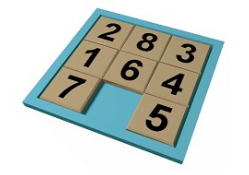
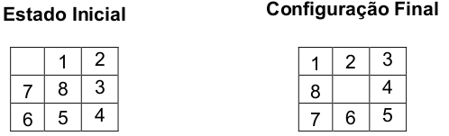

# Problemas de Busca em IA

O campo de estudo da Inteligência Artificial (IA) fica cada vez mais famoso a cada notícia que aborda o tema. Tarefas incríveis sendo realizadas por máquinas que antes eram apenas fruto da nossa imaginação.

Entretanto, é sempre bom atentarmos para os fundamentos. Um deles é o fato de que esses sistemas ou agentes inteligentes em algum momento passam por um processo de busca de uma solução dentro de um espaço de estados ou valores, tal busca sendo performada por algoritmos próprios.

A diversidade destes algoritmos é enorme. Mas como estamos falando de fundamentos, vejamos alguns que são fundamentais. São eles os algoritmos de:
- Busca em Largura;
- Busca em Profundidade;
- Busca Gulosa.

Os dois primeiros fazem parte de uma categoria chamada "busca cega", pois ela acontece sem nenhuma informação sobre o problema. A última por sua vez está na categoria de "busca heurística", pois leva em consideração alguma informação, diferente da busca cega.

Para aplicar os algoritmos, vamos abordar um problema real: a solução do quebra-cabeça de 8 peças.

## Quebra-Cabeça de 8 Peças

Um quebra-cabeça de 8 peças é um jogo comum como ilustrado na figura abaixo:

A partir de um estado inicial, o objetivo é alcançar outro com o mínimo de movimentos possível. Inclusive, para esta exemplificação, os estados inicial e final desejados serão estes:

Veja o código completo em `execucao.py` ou pelo Jupyter Notebook com uma explicação bem detalhada.
